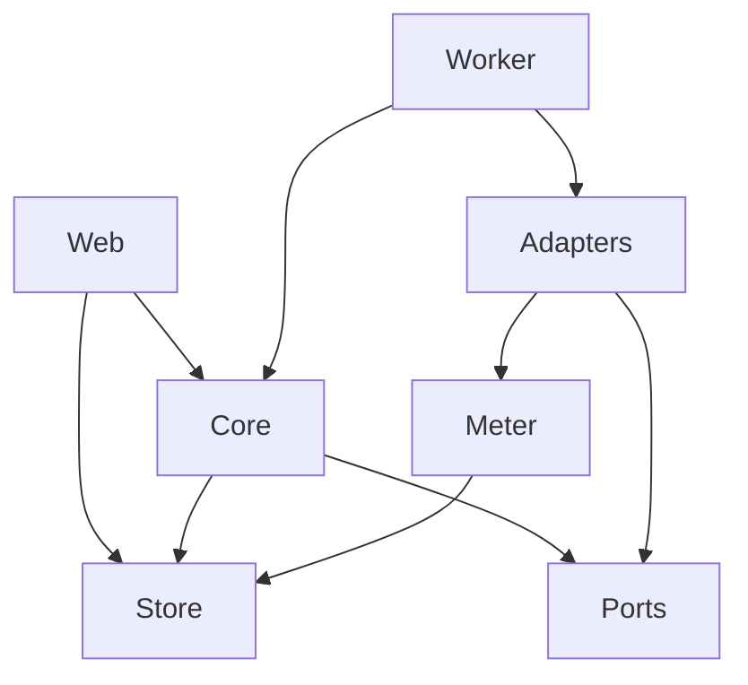
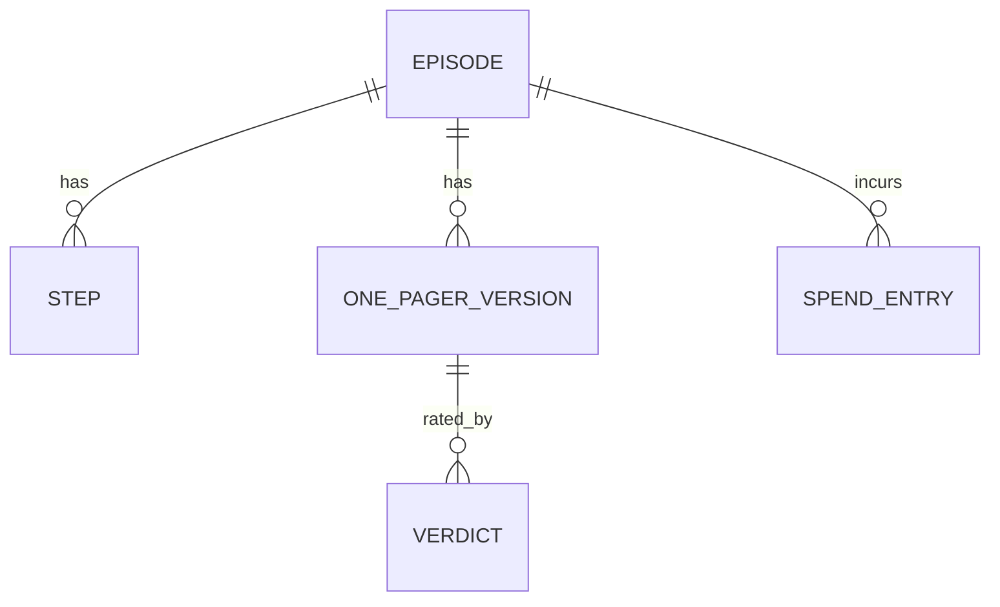

# Architecture Spine: podcast_synthesis

## Design Paradigm

**Persisted step pipeline over ports and adapters.** A Job is an ordered list of steps (`download`, `transcribe`, `summarize`, `verify`). Each step reads its inputs from the store and writes its output. Stored step state is the single source of truth. Steps call provider ports, never vendors.

| Layer | Namespace | Role |
| --- | --- | --- |
| Web | `app/web/` | Read, enqueue, record Verdicts. Never mutates step state. |
| Core | `app/core/` | Step pipeline, step state machine, cap logic, domain types. No vendor imports. |
| Ports | `app/ports/` | Interfaces: `Downloader`, `Transcriber`, `Summarizer`, `Verifier`. |
| Adapters | `app/adapters/` | One module per vendor. Implement ports. Paid calls go through the meter. |
| Store | `app/store/` | SQLite access and artifact file access. Only layer that touches either. |

## Invariants & Rules



The worker is the only composition root. It wires adapters into ports. Core and Web never import Adapters.

### AD-1 — Stored step state is the source of truth

- **Binds:** FR-2, FR-3, FR-4, FR-5, FR-6
- **Prevents:** Status or progress that lives only in memory, so a restart loses it or repeats paid work.
- **Rule:** Each step has a persisted state (`pending`, `running`, `done`, `failed`, `skipped`). A step whose output already exists and is `done` is skipped. A retry re-runs the Job and therefore skips finished steps.

### AD-2 — Steps call ports, never vendors

- **Binds:** FR-11, FR-3, FR-4, FR-6
- **Prevents:** A vendor SDK leaking into core, which makes swapping to a local model a rewrite.
- **Rule:** Core imports only `app/ports/`. Provider and model names come from config. Adding a provider means adding one adapter module and a config value.

### AD-3 — Only the worker mutates step state

- **Binds:** FR-5, FR-7, FR-8
- **Prevents:** Two writers to one Job's state (web and worker) racing each other.
- **Rule:** The web layer may enqueue a Job, read anything, and write Verdicts. It may not write step state, artifacts or the spend ledger. The worker is a single thread in the same process.

### AD-4 — Artifacts are written atomically before the step is marked done

- **Binds:** FR-2, FR-3, FR-4, FR-6
- **Prevents:** A step marked done whose file is missing or half-written after a crash or sleep.
- **Rule:** Write to a temp name in the same folder, flush, rename, and only then mark the step `done`. On startup a `running` step is treated as not done.

### AD-5 — Startup recovery and resumable vendor calls

- **Binds:** FR-5, FR-3
- **Prevents:** Jobs stuck forever after sleep, or paying twice for the same transcription.
- **Rule:** On startup the worker moves every `running` Job back to `queued`. Before waiting on a long vendor operation, the step persists the vendor's job ID, and on re-run it resumes that job instead of creating a new one. Short calls (LLM) are simply re-run.

### AD-6 — One Job at a time

- **Binds:** FR-5, FR-10
- **Prevents:** Concurrent Jobs invalidating cap accounting or hitting rate limits.
- **Rule:** The worker runs Jobs serially from a queue in submission order.

### AD-7 — Every paid call goes through the meter

- **Binds:** FR-9, FR-10
- **Prevents:** Spend that goes unrecorded, so the Daily Cap cannot be trusted.
- **Rule:** Adapters make paid calls only through the `Meter` wrapper, which appends a row to the spend ledger (episode, step, provider, amount, timestamp). The ledger is append-only. An adapter that calls a vendor directly is a violation.

### AD-8 — The cap is enforced in one place

- **Binds:** FR-10, FR-9
- **Prevents:** Different steps applying different cap rules, or a cap that stops mid-write and loses work.
- **Rule:** A single `check_budget` function runs before each paid step. It compares actual spend today plus the step's estimate to the Daily Cap. On failure the Job moves to `paused`, keeps all artifacts and waits. A paused Job never resumes by itself: the user resumes it explicitly once the budget allows. The Daily Cap uses the local calendar day.

### AD-9 — Episode identity is the YouTube video ID

- **Binds:** FR-1, FR-7
- **Prevents:** Duplicate Episodes and artifact folders that cannot be found.
- **Rule:** The primary key of an Episode is the video ID extracted from the URL. Different URL forms of the same video resolve to the same Episode. Artifacts live in `data/episodes/<video_id>/`.

### AD-10 — SQLite holds state, files hold artifacts

- **Binds:** FR-7, FR-9, FR-8
- **Prevents:** Large text or audio stored in rows, or state scattered across files.
- **Rule:** SQLite (WAL mode) stores episodes, steps, versions, Verdicts and the ledger. Audio, Transcript and One-Pager bodies are files referenced by path. Everything lives under `data/`, which is the complete backup.

### AD-11 — Downstream steps see one normalized Transcript

- **Binds:** FR-3, FR-4, FR-6
- **Prevents:** Vendor-specific transcript shapes spreading into summarizing and verifying.
- **Rule:** The `Transcriber` port returns a single timestamped Transcript in the app's own format. Splitting and stitching of audio, if a vendor needs it, is hidden inside the adapter. YouTube captions may later be added as a fallback source, normalized to the same shape (deferred).

### AD-12 — Summarize whole, fall back to map-reduce

- **Binds:** FR-4
- **Prevents:** Always-chunking that loses cross-section ideas, or overflowing a context window.
- **Rule:** The `Summarizer` sends the whole Transcript in one call. Above a configured token limit it uses map-reduce (summarize sections, then synthesize). No embeddings or retrieval in v1.

### AD-13 — Fidelity check is independent and advisory

- **Binds:** FR-6
- **Prevents:** A checker that shares the generator's blind spots, or one that silently rewrites the output.
- **Rule:** The `Verifier` uses a different vendor from the `Summarizer`, enforced by config validation. It receives the full Transcript and the One-Pager, checks each claim with quoted evidence, and independently lists the main ideas to compare against the One-Pager. It returns accuracy and coverage separately. It never blocks or modifies the One-Pager.

### AD-14 — One-Pagers are versioned and Verdicts point to a version

- **Binds:** FR-4, FR-6, FR-8, FR-7
- **Prevents:** A Verdict attached to a document that no longer exists.
- **Rule:** Every generation of a One-Pager, with its Fidelity Score, is a new numbered version and all are kept. The latest is shown. A Verdict stores the version it rated. Each version records the content hash of every prompt file used and the models used.

### AD-15 — Local only

- **Binds:** all
- **Prevents:** Exposing an unauthenticated app on the network.
- **Rule:** The server binds to `127.0.0.1`. There is no authentication. Exposing it to a network requires adding auth first.

### AD-16 — Prompts are editable files, versioned by hash

- **Binds:** FR-4, FR-6, FR-8
- **Prevents:** Prompt text buried in code, and Verdicts that cannot be traced to the instructions that produced what was rated.
- **Rule:** Each prompt is one plain-text file in `prompts/`: `summarize`, `summarize_map`, `summarize_reduce`, `verify_claims`, `verify_coverage`. The One-Pager section list is declared inside `summarize`. The app reads the section names and the model returns structured output, so the web layer renders and searches by section and never parses free text. Prompt files are read from disk at job time, so an edit applies to the next run without a restart. The Verifier's prompts are separate files from the Summarizer's. A step records the content hash of each prompt it used (see AD-14).

## Consistency Conventions

| Concern | Convention |
| --- | --- |
| Naming | Python `snake_case`. Step names: `download`, `transcribe`, `summarize`, `verify`. Job states: `queued`, `running`, `paused`, `done`, `failed`. Step states: `pending`, `running`, `done`, `failed`, `skipped`. |
| Data and formats | IDs: YouTube video ID for Episodes, integer versions for One-Pagers. Timestamps UTC ISO-8601 in storage, local time for display and the cap day. Money stored as integer micro-dollars. |
| Errors | A failed step stores an error message and a `retryable` flag. No secrets or transcript text in errors or logs. |
| Config | Secrets from environment or `.env` (git-ignored). Everything else in one config file. Prompts are plain-text files in `prompts/` (AD-16). |
| Logging | Local file. Never log API keys or transcript text. |

## Stack

| Name | Version |
| --- | --- |
| Python, managed with uv | 3.12+, uv 0.12 |
| FastAPI / Uvicorn | 0.142 / 0.54 |
| Jinja2 | 3.1 |
| htmx | 2.x (pinned, not 4) |
| SQLite via stdlib `sqlite3` | WAL mode, no ORM |
| yt-dlp (with `yt-dlp[default]`) | 2026.08.19 |
| ffmpeg, Node 22+ or Deno 2.3+ | installed on host, unbundled |
| AssemblyAI (Universal-3.5 Pro) | SDK 1.6 |
| Anthropic (Claude Sonnet 5.5) | SDK 1.9 |
| OpenAI (gpt-6.1-sol) | SDK 3.22 |

## Structural Seed

```text
podcast_synthesis/
  app/
    web/        # routes, templates, htmx fragments
    core/       # pipeline, step state machine, budget check, domain types
    ports/      # Downloader, Transcriber, Summarizer, Verifier interfaces
    adapters/   # ytdlp, assemblyai, anthropic, openai (one module per vendor)
    store/      # sqlite access, artifact file access
    worker.py   # composition root and worker thread
  config.toml
  prompts/      # summarize, summarize_map, summarize_reduce, verify_claims, verify_coverage
  data/         # podcast_synthesis.db, episodes/<video_id>/
```



## Capability → Architecture Map

| Capability | Lives in | Governed by |
| --- | --- | --- |
| FR-1 Submit | `web/`, `core/` | AD-9, AD-15 |
| FR-2 Download | `adapters/ytdlp`, `core/` | AD-1, AD-4 |
| FR-3 Transcribe | `adapters/assemblyai`, `core/` | AD-5, AD-11 |
| FR-4 One-Pager | `adapters/anthropic`, `core/`, `prompts/` | AD-12, AD-14, AD-16 |
| FR-5 Status and retry | `core/`, `web/` | AD-1, AD-3, AD-5, AD-6 |
| FR-6 Fidelity | `adapters/openai`, `core/`, `prompts/` | AD-13, AD-14, AD-16 |
| FR-7 Library | `web/`, `store/` | AD-9, AD-10 |
| FR-8 Verdicts | `web/`, `store/` | AD-3, AD-14, AD-16 |
| FR-9 Spend | `core/`, meter | AD-7 |
| FR-10 Daily Cap | `core/` | AD-7, AD-8 |
| FR-11 Providers | `ports/`, `adapters/` | AD-2 |

## Deferred

- **Authentication and remote access:** not needed while local only (AD-15).
- **Audio pruning:** keep audio by default. An optional prune setting can come later if disk fills.
- **Semantic search and embeddings:** plain text search only in v1.
- **YouTube captions fallback:** dropped from v1 scope.
- **Local transcription and local LLM adapters:** only the ports exist in v1.
- **Backups beyond copying `data/`.**
- **Packaging and auto-start on login:** run by hand in v1.
- **YouTube download hardening:** PO tokens and cookies if YouTube blocks downloads.
