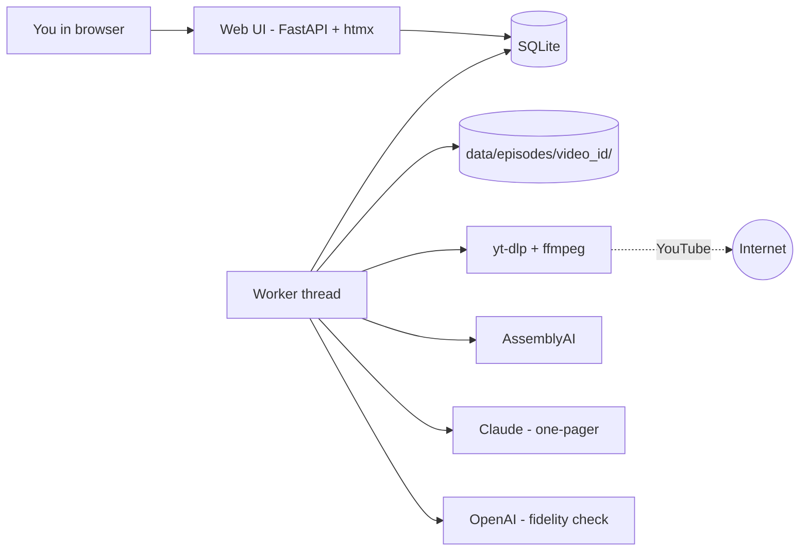
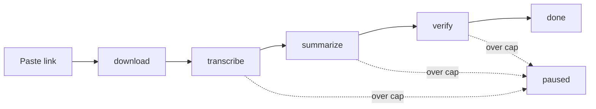
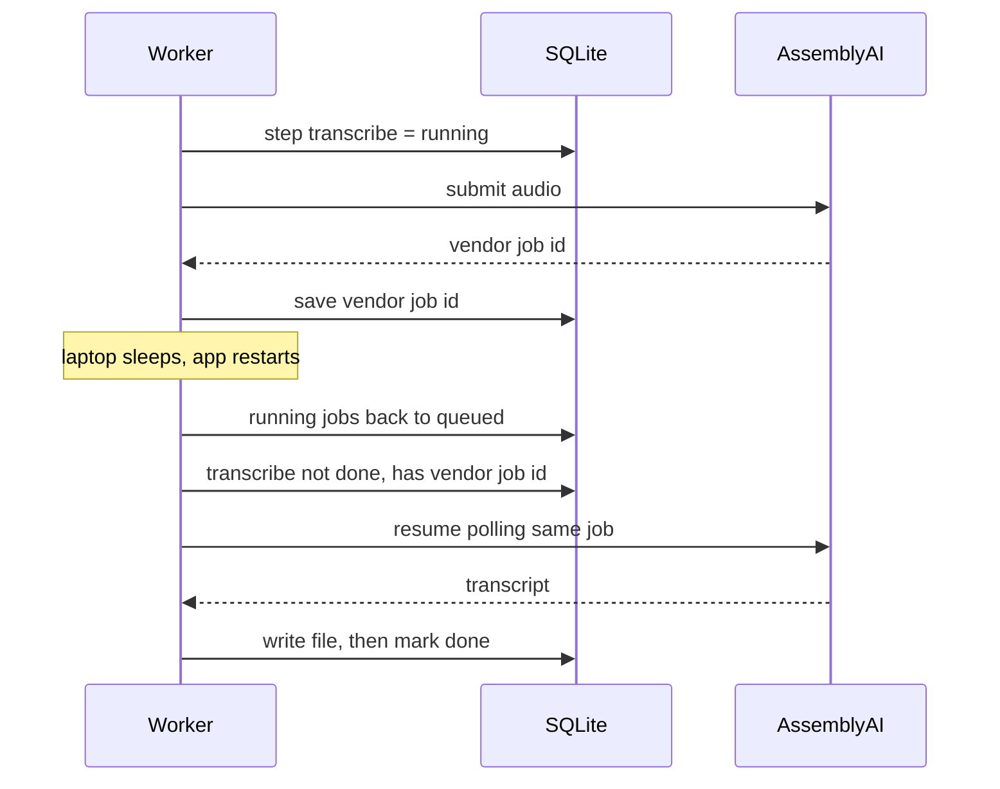

# podcast_synthesis: Architecture Overview

For the builder. The binding rules are in `ARCHITECTURE-SPINE.md`. This page explains the shape.

## In one paragraph
You paste a YouTube link into a local web page. A single background worker downloads the audio, sends it to a transcription service, has Claude write a one-page synthesis, and has OpenAI fact-check that page against the transcript. Every result is saved, every dollar is recorded, and if your laptop sleeps mid-job the work resumes where it stopped.

## System view

## One Job

## Sleep and restart

## Prompts
Every prompt is a plain-text file in `prompts/`, including the One-Pager section list. Edit a file and the next job uses it. Each One-Pager version records the hash of the prompts behind it, so a Verdict traces to the exact instructions.

## What it costs
About $0.40 for a one-hour episode and about $2 for a six-hour one. Most of it is transcription. The $5 daily cap allows roughly a dozen one-hour episodes.

## What you need on your machine
Python 3.12 with uv, ffmpeg, Node 22 or Deno 2.3, and API keys for AssemblyAI, Anthropic and OpenAI.

## Not in v1
Login or network access, semantic search, local models, audio pruning, auto-start.
